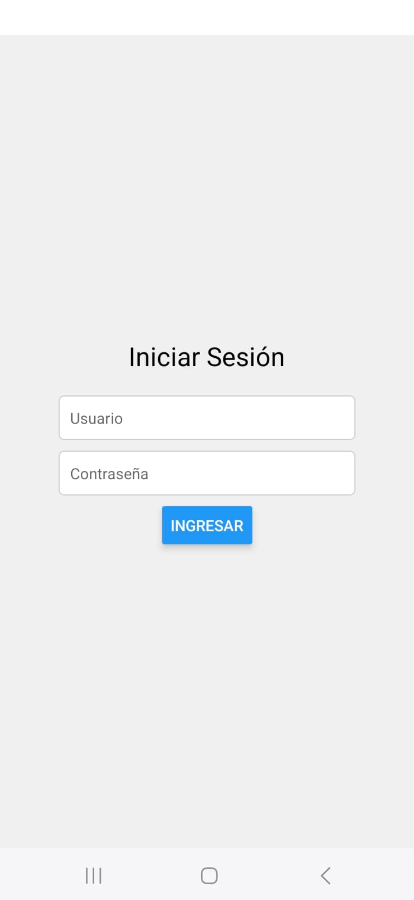
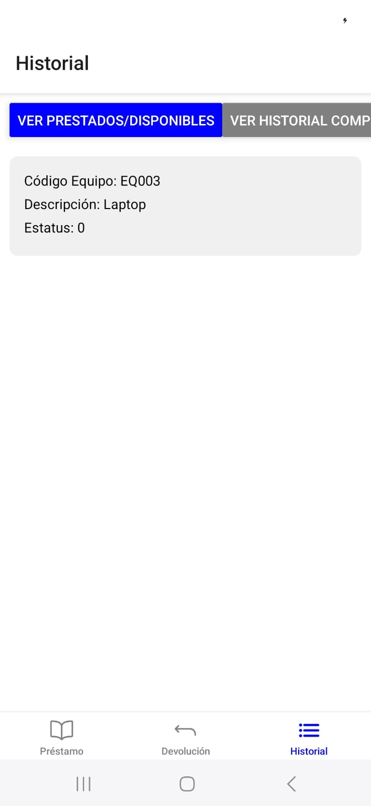
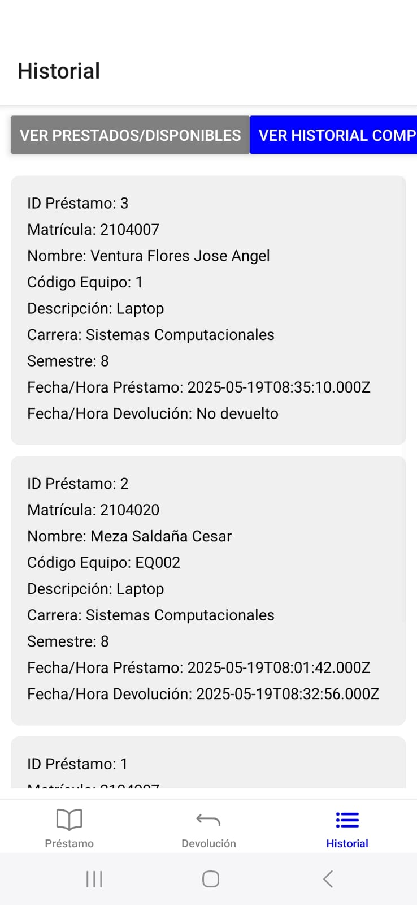
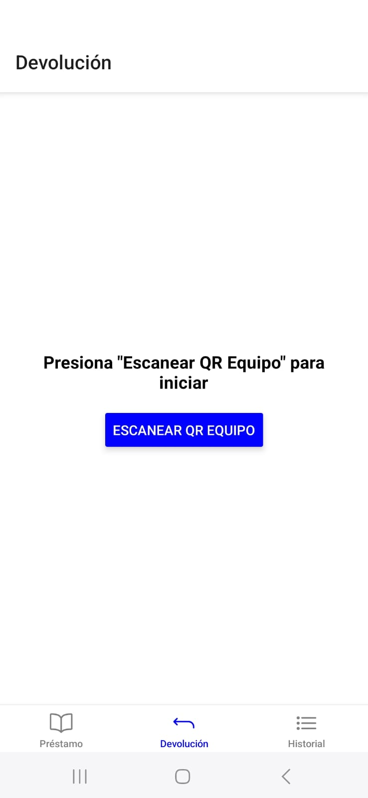

📱 ESCIHU Equipment Loan App
🧩 Description (English)
A mobile application designed to manage equipment loans at the Escuela Superior de Ciencias y Humanidades (ESCIHU). Users can request items such as computers, projectors, and power extensions through a simple and intuitive interface.

🔧 Features
QR code scanning for quick equipment registration

Loan history tracking per user

Backend powered by Node.js, Express, and MySQL

Built with React Native and Expo

🛠️ Installation
Clone the repository:

Código
git clone https://github.com/joseangelventuraflores/ReactNative-PrestApp.git
cd ReactNative-PrestApp

Install dependencies:
npm install

Start the backend server:

node server.js

Launch the mobile app with Expo:

Código
npx expo start
Make sure you have Node.js, Expo CLI, and a MySQL database configured locally or remotely.

🗃️ MySQL Database Setup
📄 SQL Setup: See [`prestamo_equipos_escihu.sql`](database/prestamo_equipos_escihu.sql) for full schema.

Create a database named prestamo_equipos_escihu.

Run the following SQL script:

-- Crear la base de datos
CREATE DATABASE IF NOT EXISTS prestamo_equipos_escihu;
USE prestamo_equipos_escihu;

-- Tabla: alumnos
CREATE TABLE IF NOT EXISTS alumnos (
  matricula VARCHAR(10) PRIMARY KEY,
  nombre VARCHAR(100),
  carrera VARCHAR(100),
  semestre INT
);

-- Tabla: equipos
CREATE TABLE IF NOT EXISTS equipos (
  codigo_equipo VARCHAR(10) PRIMARY KEY,
  descripcion VARCHAR(100),
  estatus TINYINT(1)
);

-- Tabla: prestamos
CREATE TABLE IF NOT EXISTS prestamos (
  id INT AUTO_INCREMENT PRIMARY KEY,
  matricula VARCHAR(10),
  codigo_equipo VARCHAR(10),
  fecha_prestamo DATETIME DEFAULT CURRENT_TIMESTAMP,
  fecha_devolucion DATETIME,
  FOREIGN KEY (matricula) REFERENCES alumnos(matricula),
  FOREIGN KEY (codigo_equipo) REFERENCES equipos(codigo_equipo)
);

Configure your database connection in server.js:

js
const connection = mysql.createConnection({
  host: 'localhost',
  user: 'your_user',
  password: 'your_password',
  database: 'prestamo_equipos_escihu'
});

📸 Screenshots
### Inicio de sesion

### Prestamo de equipos

### Historial de Préstamos

### Devolución

